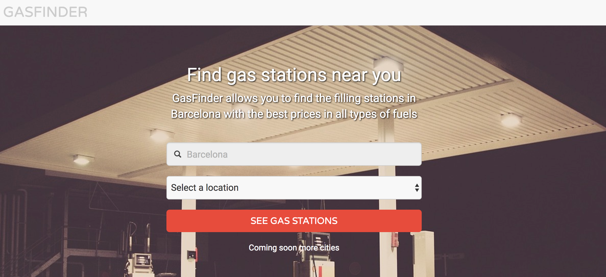

      

 

## GasFinder

### Introduction

This repo contains the Web App developed with [AngularJS](https://angularjs.org/) at [Skylab Coders Academy](http://skylabcoders.com/) Full Stack Web Development Bootcamp. 

[GasFinder](https://tonimg.github.io/GasStationApp/) uses the [Sede electrónica del Ministerio API](https://sede.minetur.gob.es/es-ES/datosabiertos/catalogo/precios-carburantes) and allows you to find the filling stations in Barcelona with the prices in all types of fuels: Gasolina 95, Gasolina 95 No de Protección, Gasolina 98, Diesel, Diesel Mejorado, Gasóleo B, Gasóleo C, Biodiesel, Bioetanol, GLP and GNC.

## Coding Style

All the code has been developed under the JavaScript Standard Style

## Built With

SublimeText - Text editor

## Authors

- [Toni Marchante](https://github.com/tonimg) 
- [Leonel Meirinh](https://github.com/LeonelAV) 
- [Núria Escudé](https://github.com/nuriaescude) 

## License

This project is licensed under the MIT License - see the LICENSE.md file for details

## API Reference

- [ngMap - GoogleMap AngularJS Directive](https://github.com/allenhwkim/angularjs-google-maps)
- [ngMap documentation](https://ngmap.github.io/)
- [ngMap directives](https://rawgit.com/allenhwkim/angularjs-google-maps/master/build/docs/index.html)
- [Google Maps API](https://developers.google.com/maps/documentation/javascript/)
- [Sede electrónica del Ministerio](https://sede.minetur.gob.es/es-ES/datosabiertos/catalogo/precios-carburantes)

## Acknowledgments

- [SkylabCoders](http://skylabcoders.com/)
- [JuanMa Garrido](https://github.com/juanmaguitar)
- [AlejandroDG](https://github.com/agandia9)
- [Sede electrónica del Ministerio](https://sede.minetur.gob.es/es-ES/datosabiertos/catalogo/precios-carburantes)
